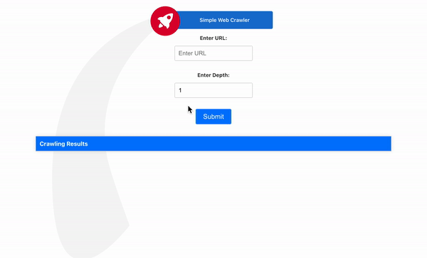

# Laravel 8 Web Crawler with Angular Frontend

This project combines a Laravel 8 backend with an Angular frontend to create a web crawler that fetches website data based on user input. The crawler's outcomes are displayed in a visually pleasing table format.

## Docker
 To run the application with docker-compose, run the following command from the project root directory:

    docker-compose up -d --build

Access the application at http://localhost:4200.

### If You dont have Docker on your Machine

#### Prerequisites

Before running the application, make sure you have the following dependencies installed:

- [PHP](https://www.php.net/downloads.php) >= 8.2
- [Composer](https://getcomposer.org/)
- [Node.js](https://nodejs.org/)
- [npm](https://www.npmjs.com/get-npm)

### Backend (Laravel)

#### Installation

Clone the repository:

    git clone https://github.com/sagiweizmann/laravel-webcrawl.git
   
Navigate to the project directory:

    cd laravel-crawler

Install PHP dependencies using Composer:

    composer install

Create a .env file by copying the example:

    cp .env.example .env

Generate an application key:

    php artisan key:generate

Configure your database settings in the .env file.

Running the Backend
To start the Laravel backend, run the following command:

    php artisan serve
The backend will be accessible at http://localhost:8000.

### Frontend (Angular)
#### Installation
Navigate to the angular-frontend directory:

    cd src/frontend
Install Angular CLI globally (if not already installed):

    npm install -g @angular/cli
Install frontend dependencies:

    npm install

Running the Frontend

To start the Angular frontend, run the following command from within the angular-frontend directory:

    ng serve
The frontend will be accessible at http://localhost:4200.

## Usage

Open the frontend in your web browser.

You will see an interface with input fields for the URL and depth, alongside a submit button.

Enter the URL and depth you want to crawl and click the submit button.

The crawler's outcomes will be displayed in a visually pleasing table format.

## License
This project is licensed under the MIT License. See the LICENSE file for details.
